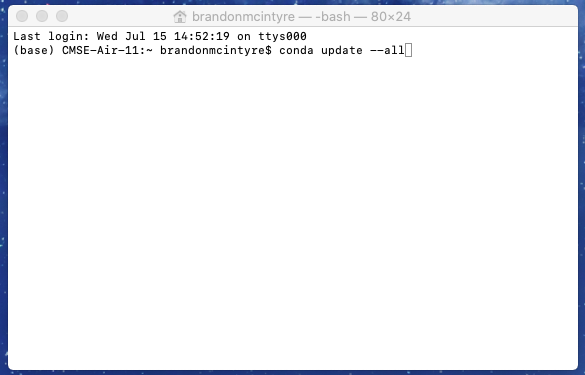
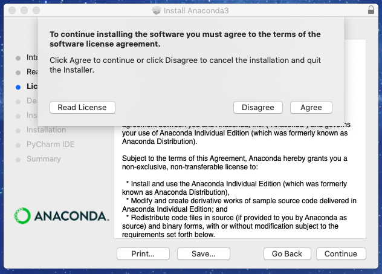
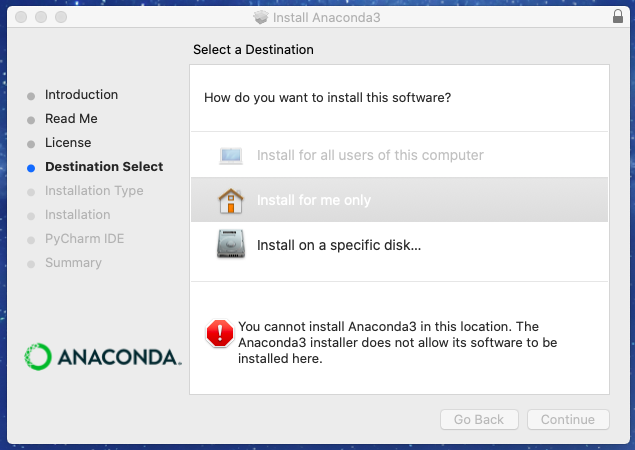
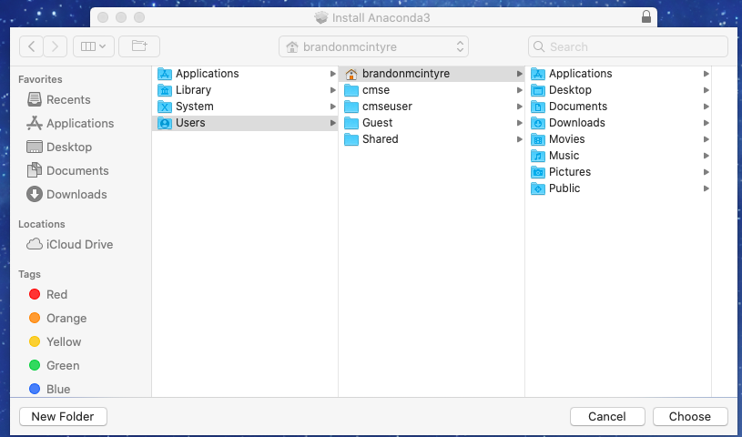

# CMSE 202 - Fall 2020    Set-up Guide Mac
---
# Table of Contents

* [Installing Python for this Course](#install)
    * [If you have Anaconda on your computer already](#already)
        * [Let's make sure Anaconda is updated to the latest version](#latest)
        * [Also let's check to make sure that Anaconda is in your path](#path)
        * [If any of the above fail, remove anaconda and reinstall. To remove Anaconda follow these steps](#fail)
        * [Catalina Update](#catalina)
    * [If you don't have a fully functioning up-to-date installation of Anaconda](#dont)
* [Setting up the terminal with Git](#terminal)
    * [Check to see if you already have Git](#git_check)
        * [Git download](#git_down)
        * [(Optional) Helpful Commands and Shortcuts](#optionalmac)
            * [Setting up Finder](#mac_home_short)
            * [Knowing Where You Are](#mac_where)
            * [Setting up Terminal to Show Full Path](#mac_path)
            * [Useful Commands](#mac_command)
* [Setting up Spyder (Text Editor/Python IDE)](#spyder)
* [MSU's JupyterHub Interface](#jhub)
    * [Connecting to the engineering JupyterHub server](#conn)
    * [Getting Jupyter notebook files into JupyterHub](#upload)
    * [Making a copy of Jupyter notebooks from JupyterHub and turning them in](#copy)
* [Course Communication with Slack](#slack)
    * [Slack usage rules](#rules)

---
As this is a course in computational modeling and data science, you will be completing all of your assignments using your computer! However, in order to do so there are a number of things you need to set up before the course starts. If you run into issues during this setup process make sure to document the error you encountered and send an email to your Professor to let them know that you ran into a problem.

**MAKE SURE TO COMPLETE ALL OF THE SECTIONS LISTED IN THIS DOCUMENT BEFORE YOU COME TO CLASS**

---

# Installing Python for this Course
You need to have a functioning and **current** Anaconda Python installation on your computer for this course. If you have a past installation, you are expected to make sure it is up-to-date. In addition to making sure your installation is updated, you should also ensure that the Anaconda installation is in your default path.

## *If you have Anaconda on your computer already*  
### (If you do not have Anaconda [click here](#dont))

***NOTE 1: If you had Anaconda installed previous to updating to macOS Catalina (Released October 7, 2019) or beyond, your installation is most likely broken. There is a way to [repair](https://www.anaconda.com/blog/how-to-restore-anaconda-after-macos-catalina-update) Anaconda but this is experimental and quite a bit of work. It is much easier to just reinstall  Anaconda. Follow this section [here](#catalina) if this applies to you.***  

***NOTE 2: If you did not have Anaconda installed previous to updating to macOS Catalina (Released October 7, 2019) you can install Anaconda just fine. However, go to this section [here](#2) and complete only step 2.***  

***NOTE 3: As a general rule of thumb, do not upgrade your OS mid-way during the semester or school year as things like the above can happen. Always be prepared for OS updates to break applications.***  

### Let's make sure Anaconda is updated to the latest version:

1. Be connected to the internet  
2. Find your terminal and update Anaconda.  
     Using Spotlight by pressing <kbd> command </kbd> + <kbd> space-bar </kbd> or simply use the search bar in the top right corner search `terminal` and press `Enter`. Then type in the command `conda update --all` and press `Enter`. This command will update anaconda.  
    
     To continue type `y` and press enter.  
    
     If all goes well you should be all updated.  
  

### Also let's check to make sure that Anaconda is in your path.

1. Have anaconda installed on system.  
2. Open up the terminal and run Jupyter Notebook.  
     Using Spotlight by pressing <kbd> command </kbd> + <kbd> space-bar </kbd> or simply use the search bar in the top right corner search `terminal` and press `Enter`. Then type in `jupyter notebook` and press `Enter`. 
    
      This should launch a jupyter notebook tab on a web browser and the terminal should look like this.
    
      To exit jupyter notebook close the tab on the web browser, and go to the terminal window and type <kbd> control </kbd> + <kbd> c </kbd> twice in a row.  

### If any of the above fail, remove anaconda and reinstall. To remove Anaconda follow these steps.  

1. Make sure you have [read the above](#already) notes.
2. Open up the terminal and download `anconda-clean`
     Using Spotlight by pressing <kbd> command </kbd> + <kbd> space-bar </kbd> or simply use the search bar in the top right corner search `terminal` and press `Enter`. Then type in `conda install anaconda-clean` and press `Enter`. (If this fails, continue on with as much as you can, then reinstall)  
    
     To continue type `y` and press enter.  
    
     Type in the terminal `anaconda-clean --yes` and press `Enter`. (or you can run it without the `--yes`, but will have to agree to each deletion.)  
    
     If all goes well you should not encounter any errors. This process deleted some anaconda files, but there are still some more to delete.  
3. Delete the `.anaconda_backup`.  
      We now can remove the `.anaconda_backup` by typing `rm -rf .anaconda_backup`. Then press `Enter`.  
4. Edit the `.bash_profile`.   
      Next we need to edit our `.bash_profile` to remove Anaconda references. To open the file type `open -a TextEdit .bash_profile` and press `Enter` this will open the file in `TextEdit`.  
      First you will want to delete the line, *if it exists*, that says `export PATH=[MAYBE_DIFFERENT_FOR_YOUR_SYSTEM]/anaconda3/bin:PATH`. Note that it may be different for your system but you are looking for something generally like this.  
      Next we will need to note the path to the Anaconda3 folder. You can see this here in the file. We can copy this path to our clipboard by pressing <kbd> command </kbd> + <kbd> c </kbd>.  Be sure to copy only up to the end of `anaconda3`.
      Now we will need to delete the `conda initalize` block.  
      The file should now be cleared of what is needed. (*Note: If you are on on macOS Catalina notice the last line in this file. This is what you need to silence the warning you get when booting up the Terminal if you are using `bash` (which is what was recommended). You can put this line in there if you would like to silence this warning*)
5. Using the path that you copied from the previous, we need to delete `Anaconda3` folder.
      Go back to the terminal and type the following `rm -rf ` then press <kbd> command </kbd> + <kbd> v </kbd>. When done it should look like the following `rm -rf /Users/brandonmcintyre/me/anaconda3`, but be aware the path that was copied over will be different for you. Then press `Enter`. This might take a few moments to run, be paitent.
6. Congrats, you are done. Now you can [re-install](#dont) Anaconda.
    

### Catalina Update
This section is only for if you are running macOS Catalina or later

1. Make sure Anaconda is broken by trying to open `Anaconda-Navigator`.
     Using Spotlight by pressing <kbd> command </kbd> + <kbd> space-bar </kbd> or simply use the search bar in the top right corner search `Anaconda-Navigator` and press `Enter`. If you recive this prompt, your Anaconda is broken.  

2. Open the terminal and see if you notice the warning "The default interactive shell is now zsh". Using Spotlight by pressing <kbd> command </kbd> + <kbd> space-bar </kbd> or simply use the search bar in the top right corner search `terminal` and press `Enter`. If you *do not* see the warning, and the top of the terminal says something like this `[YOUR_USERNAME_HERE] - -zsh - [SIZE_OF_WINDOW]` skip to the next step [2a](#2a).  
     The warning means that the default "shell" terminal macOS Catalina uses has changed from `bash` to `zsh`. The "shell" is basically the program you give commands to that gives commands to the computer. This warning will always pop up everytime terminal is started. You can do a few things about this: do nothing, [remove the warning](https://www.saintlad.com/hide-default-interactive-shell-is-now-zsh-in-terminal-on-macos/), or change your shell to `zsh` at your own risk as we will be using `bash` in this course. (If you do change your shell it will change the configuration files you use, which if you [follow this guide](https://scriptingosx.com/2019/06/moving-to-zsh-part-2-configuration-files/) you can transfer the `.bashrc` and like files to the appropiate `.zshrc` like files. If you want to change back to the `bash` shell you can run the command `chsh -s /bin/bash`.) Move to step 3 after deciding on your option.  
    
    **2a.**  Currently, you are running the `zsh` shell. This is either because you changed it yourself, or you created a new user account on a MAC that is running macOS Catalina. The "shell" is basically the program you give commands to that gives commands to the computer. You may stay on this shell at your at your own risk as we will be using the `bash` shell in this course. (If you *do not* change your shell you will be using different configuration files, which if you [follow this guide](https://scriptingosx.com/2019/06/moving-to-zsh-part-2-configuration-files/) you can transfer `.bashrc` settings and like files to the appropiate `.zshrc` settings and like files).  
     If you want to change to the `bash` shell you can type `chsh -s /bin/bash` in the Terminal and pressing `Enter`. You will then be prompted to enter the password to the user account. Then close and re-open terminal and you should notice the warning in which case you can go back to step 2.  
    
3. Move the `Anaconda-Navigator` in the `Applications` folder into the trash.
     Open up `finder` and navigate to the `Applications` folder by clicking on the folder in the navigation pane on the left hand side of the `finder` window. Then click and drag the `Anaconda-Navigator` to the `Trash` in the bottom right hand corner of the screen. If `Anaconda-Navigator` is also in your dock, you can also move that to the `trash`.
    
4. Follow the steps to [install Anaconda](#dont).

## *If you don't have a fully functioning up-to-date installation of Anaconda*

Instructions for downloading Anaconda (Python 3.7.x):
1. Go to the [Anaconda Download webpage:](https://www.anaconda.com/download/)
2. Use the `download` button under the `Your data science toolkit` (or just scroll until you see `Anaconda Installers`)  
      
3. Download the Python 3.7 version, you'll notice there is a "Graphical" and "Command Line" installer. This guide covers the Graphical, but feel free to use the Command Line if you wish.
    
4. After downloading, run the `Anaconda3` installer that popped into the dock (or you can open it from the `Downloads` folder as well).
     Press the `Continue` button  

     Press the `Continue` button.   
      
     Press the `Continue` button.   
      
     Press the `Continue` button.
    
     Press the `Agree` button. 
      
     You may notice that there is an error if you are running macOS Catalina or higher. We will want to change the destination for both the sake of macOS Catalina users, and those that are running macOS Mojave or sooner in case if you ever do update to macOS Catalina. Click on `Install on a specific disk...`
    
     Make sure to click and select your main harddrive (You may only have one if no other storage device is connected to the compiter). Then click the `Choose Folder...` button.
      
     Then click on the `Users` -> `[YOUR_USERNAME]`. The `[YOUR_USERNAME]` should be the username of the account you are logged into. In my case this is `brandonmcintyre`. Then click in the bottom left hand corner on the `New Folder` button.
    
     You can enter any name you want for the folder as long as it does not have a space in it. For this tutorial we will use `me`. Then click `Create`.
    
     If all went well the folder should be created and should be automatically selected. Now click the `Choose` button.
    
     Press the `Continue` button.
      
      Press the `Install` button.
      
      Enter your password then click `Install Software`.  
      
     This may take a moment to install.
      
     Press `OK` button to allow.  
    
     Press the `Continue` button.
    
     Then press the `Close` button. Then to finish, press `Move to Trash` to delete the installer.  
    
5.  
     Open terminal on your computer by using Spotlight by pressing <kbd> command </kbd> + <kbd> space-bar </kbd> or simply use the search bar in the top right corner search `terminal` and press `Enter`. Then type `jupyter notebook` in the command line and hit enter.  
    
     This should launch a jupyter notebook tab on a web browser and the terminal should look like this.  
    
     To exit jupyter notebook close the tab on the web browser, and go to the terminal window and type <kbd> control </kbd> + <kbd> c </kbd> twice in a row. Now you can close the terminal.   
    
6. *If your anaconda installation was successful* follow the instructions above under `Installing Python for this Course` -> `If you have Anaconda on your computer already` -> `Let's make sure it is updated to the latest version` to update Anaconda and all of its packages ([or follow this link](#latest)).

---

# Setting up the terminal with Git

In this course, we will learn how to perform python and data analytics outside of the Anaconda enviroment. We will also learn new tools, such as as git (a version control utility that we will learn more about later), and other useful tools powered by the command line. Using the terminal will open our abilites of what we can do, and is a great way to start opening up new avenues in computing.  

Unlike our Windows friends, MAC and Linux terminal automatically uses a *Unix-like* command line interpreter. This makes it a little easier on our end as we will not need to install another terminal on our machine. However, we will still need to make sure we have Git avalible on our terminals.  

## *Check to see if you already have Git*
1. Have Anaconda installed.
2. Open up terminal, and check the version of Git.
     Using Spotlight by pressing <kbd> command </kbd> + <kbd> space-bar </kbd> or simply use the search bar in the top right corner search `terminal` and press `Enter`. Then type in `git --version` and press `Enter`. If you recive a version you have git installed, if recieve an error you do not have git installed. If you ran into a warning follow the instructions below. *If you want to learn some optional tools and shortcuts continue to the [next section](#optionalmac). However, if you want to skip the optional section, [click here](#jhub).* 

### Git download.  
1. Install `Homebrew`. Visit the [Homebrew main page](https://brew.sh/) for instructions on how to install `Homebrew`
     Copy and paste the terminal command into the terminal and press `Enter`.
      Enter the password to your account and press `Enter`.  
      To continue press the `Enter` button. This will take a moment to install everything necessary.
      To continue enter your password. Press the `Enter` button.  
      If sucessful you will now be done.
2. In the terminal install git via homebrew.
      Type in the terminal `brew install git`. Then press `Enter`.  
      If successful, there should be no errors, to test type `git --version` and press `Enter`. You should then see a version.

*If you want to learn some optional tools and shortcuts continue to the next section. However, if you want to skip the optional section, [click here](#jhub).*    

### (Optional) Helpful Commands and Shortcuts
The command line is a powerful, but also complex tool. The following are some commands and shortcuts that will make using the command line on terminal easier. This is optional, but this will serve as a guide to make common actions you may need to take using the terminal in this course easier.

**Setting up Finder**  
Throughout this course you will be downloading many notebooks and files and knowing how to access those is essential. When it comes to the terminal, the directory you start your session in is known as the "home directory" and is not immediately see-able from `Finder`. However, thankfully we can enable this folder in `Finder` easily.

1. Open up `Finder` and open up `Preferences...`
      Open up the `Finder` program and click on `Finder` in the left hand corner. Then click `Preferences...`.
2. Enable the your home folder in the `Sidebar`.
      Click on the `Sidebar` tab. Then click on the check box next your username (The icon next to it should be a house).
3. Enable the option to see file extensions in `Advanced`.  
      Click on the `Advanced` tab. Then click on the check box next to `Show all filename extensions`.  
4. Close Preferences. Then enable the `Path Bar`
      Close the Prefernces window, then in the upper left-hand corner click on `View`. Then click on the option `Show Path Bar`.
5. Continue to the next section if you want to learn how to utilize the tools you just enabled.
    
The above will serve useful when you need to copy or place files in your home directory, or you want to access the home folder from the `Finder`.  

  
**Knowing Where You Are**  
When starting up the terminal it is important to know where you are in the system. In this course we will be making and using directories/folders. Making sure we know where we are at is crucial to this process. When terminal opens it is likely you will start in what is known as your "home" directory signified by `~`. There is a slim possibly you may start in the root directory signified by `/` if settings become changed or corrupted. In this course, we will never need to do anything with the root (`/`) directory as this is a where important files for the macOS live.

1. Open up terminal, and view the home folder on `Finder` and enable column-view.
      Open terminal on your computer by using Spotlight by pressing <kbd> command </kbd> + <kbd> space-bar </kbd> or simply use the search bar in the top right corner search `terminal` and press `Enter`. Then re-size the window and move the `Finder` window around until you have both side-by-side. In the `Finder` click on the newly availible home folder tab. You should see all the folders in this picture.
      In the finder window enable column-view by clicking on the column-view button on the top of the finder.
2. Use `ls` to list all the contents of the directory/folder
     Now in the teriminal type `ls` and press `Enter`. The `ls` command lists all the contents of the directory/folder. You can see now that folder terminal starts in, is this folder that is open in the `Finder`. If you want, you can play around with this and see all of the folders you have access to from this folder by clicking on the folders/directories in the `Finder` window. You will notice that as you click on folders/directories and files the `Path Bar` on the bottom of the `Finder` window we set up earilier will change as your "path" changes.
3. Notice the terminal and change directory to `Downloads`.
      Take a look and you will notice that on the same line where you input your commands there is the same repeating line `(base) [COMPUTER_NAME]:[LOCATION] [USERNAME]`\$. For reference the image above shows this computer having the line `(base) CMSE-Air-11:~ brandonmcintyre`\$. The `(base)` is referring to the fact that the `conda` enviroment is running. This comes from the use of `Anaconda` and having this `conda` `(base)` running allows us to useful commands from `Anaconda`. For our purposes we can keep this enviroment active with no issues, but if you ever needed to deactivate the enviroment for any reason you can use the command `conda deactivate`. You will notice the `(conda)` will disappear meaning you are out of the enviroment. However, please note in order to use Anconda and its tools you will need this enviroment activated. In order to re-activate the Anaconda enviroment, run the the command `conda activate`. The rest of the line you can match up to the template. `[COMPUTER_NAME]` = `CMSE-Air-11`, `[LOCATION]` = `~` (which we know is short for the home directory), `[USERNAME]` = `brandonmcintyre`.  
      Now we will use the `cd` command to "change directory" to the `Downloads` folder. To change the directory/folder to the `Downloads` folder we just need to type `cd Downloads` and press `Enter`. Notice a few things. *First*, You may be prompted to allow `Terminal.app` to have access to the `Downloads` folder, allow this. *Second*, that when typing `Downloads` if you were to hit the `Tab` key on the keyboard after typing `Down` it would auto-complete to `Downloads/`. This is a feature of the command line that will prove very useful as it can look at all the files in the directory you are in (or going to) and auto-complete if it finds the match. *Finally*, notice how the `[LOCATION]` change from `~` to `Downloads`. This is letting you know that you are now in the a new directory/folder.
      You can see all the files in the `Downloads` directory/folder by running the command `ls` and press `Enter`. Here, you may notice that in the photo there is a `.ipynb` in this directory. We can actually start up jupyter notebook in this directory from our terminal and open this file if we wish. You can do this by running the command `jupyter notebook`  and pressing `Enter`. This will open Jupyter Notebook in your current directory/folder (The `Downloads` folder).  
      
      To close down Jupyter Notebooks close the browser and then type <kbd> control </kbd> + <kbd> c </kbd> twice in a row. *Note: You can go back to the home directory/folder by typing `cd ..` and pressing `Enter`. The `..` means "parent" directory/folder. Which just means the folder that the current folder belongs to. So the `Downloads` directory/folder belongs to the home directory/folder.*

  
**Setting up Terminal to Show Full Path**  
As seen in the above section, when you change directories (folders) the terminal will display the name of the directory (folder) but not the full path (you will learn later in class what path means). This may not be apperent if you have not used terminal before, as showing the full path is a common thing to see when using other unix command lines. To enable this we just need to make a simple edit to your `.bash_profile`

1. Open terminal and open up `.bash_profile`.
      Open terminal on your computer by using Spotlight by pressing <kbd> command </kbd> + <kbd> space-bar </kbd> or simply use the search bar in the top right corner search `terminal` and press `Enter`. Then in the terminal type `open -a TextEdit .bash_profile` and press `Enter` on the keyboard.
2. Add `export PS1='\u@\H:\w$` just before `# >>> conda initalize >>`  
      Using the text editor, place this exact command `export PS1='\u@\H:\w$` just before `# >>> conda initalize >>`. This is very important that it comes before the `conda intilaize` block of code. Also it may try to autocorrect `export` to `Export`, this is not correct it needs to be lowercase. You may need to add a few lines using `Enter` in order to get the spacing as it is above. Once done you can simply close out of the TextEdit window.  
3. Close the terminal and reopen terminal.
     Closing the terminal and reopening it should yeild something like the above. You might not notice anything different. However, like we did above, "change directory" by typing `cd Downloads` and pressing `Enter` on the keyboard. Now you should see, how unlike before, you see your location in relation to the home folder `~/Downloads`. This will prove very useful later on in class.

**Useful Commands**
* `cd [DIRECTORY/FOLDER_NAME]` -- Will change the current directory your terminal is in to the folder specified.
* `cd ..` -- Will change the current directory your terminal is in to the the parent directory/folder of the current directory/folder.
* `open .` -- Will open up the current directory your terminal is in, in `Finder`.
* `open -a TextEdit [FILE_NAME]` -- Will open up the specified file with the `TextEdit` notepad program
* `clear` -- If you want to "clean" up the terminal to clear past commands from view, you type this command.
* `cat [FILE_NAME]` -- This will print all the contents of the specified file into the terminal for easy viewing.

---

# Using Spyder (Text Editor/Python IDE)
Spyder is a program apart of the Anaconda distribution. It can be used to edit text files, as well as run Python code. Since it is built into Anaconda, this will be our deafult way of editing text files. There are other solutions out there such as Atom, Sublime, and many others. You are more than welcome to explore these other options, however, we will use this one as it is already pre-installed through the Anaconda.  

Spyder can easily be started from one or two ways
1. Open `spyder` through using Spotlight
     Using Spotlight by pressing <kbd> command </kbd> + <kbd> space-bar </kbd> or simply use the search bar in the top right corner search `spyder` and press `Enter`. It will open a up a terminal and then start the program.
2. Using the terminal to start the program.
     Open up terminal and type `spyder` and press enter. *Note: You can also open up files directly into spyder this way as well, you just need to include the path to the file. For example `spyder [FILE]` or `spyder [FOLDER/FILE]`.*
    
**Once Spyder is open you should see something that looks like below. Follow the letters to learn more about these otpions**

- **A.** This option you can use to open files. This is the alternative to opening files then opening them through the command line. Once you click on this icon another folder will open up.
     Notice how in the photo the options to the right of the `File name:` is clicked. Make sure before trying to navigate to the file you want to open, you click on the `All files` option to be able to see/open any file. *Note: If you need to open a file that is in your home directory, and if you followed the optional guide above, you can quickly get there by using the Favorites*

- **B.** This is where the file that is opened will display.

- **C.** This is place where you can look at files, or assigned varaibles from running scripts (will learn more about this later). You can change what you see by clicking the tabs.

- **D.** This is an `iPython` console where you can run python commands and test out anything you want (will come more in handy when writing python scripts)

---

# MSU's JupyterHub Interface

From time to time, you might run into issues with your computer. When this happens, you should use the web-hosted JupyterHub server managed by MSU. It creates a virtual environment that allows you to run simple commands and host Jupyter notebooks. To make sure that you have access to this backup option, follow the directions below. Note that there are extra steps involved that require that you upload and download you Jupyter notebooks to and from JupyterHub in order to turn them in on D2L.  

## Connecting to the engineering JupyterHub server

Every student enrolled in this class will be given an engineering computing account. If this is your first time using your Engineering account you will need to activate the account by going to the following website:

[https://www.egr.msu.edu/decs/myaccount/?page=activate](https://www.egr.msu.edu/decs/myaccount/?page=activate)

Enter your MSU NetID. The initial password will be your APID with an @ on the end (example: A12345678@) and then you have to set a password that meets the requirements listed on the page. Verify the password. Then agree to the terms and Activate.

Once your account is activated you can access the classroom Jupyterhub server using the following instructions:

1. Open up a web browser and go to the following URL: [https://jupyterhub.egr.msu.edu](https://jupyterhub.egr.msu.edu)
2. Type your engineering login name. This will be your MSU NetID.
3. Type your engineering password.

If everything is working properly you will see the main “Files” windows in the Jupyter interface.

If you ever end up working on your assignments using JupyterHub, the remaining directions should serve as a reference for how you can go about uploading and downloading Jupyter notebooks and turning them in.

## Getting Jupyter notebook files into JupyterHub

IPython notebooks (also referred to as Jupyter notebooks) are files that end with the .ipynb extension.  We will give you these files for all of your assignments, you will edit them and turn in the edited files in using the class Website.

You can download the ipynb assignment files from the class website ([http://d2l.msu.edu](http://d2l.msu.edu)). Once you have an ipynb file you can load it into Jupyter using the “upload” button on the main “Files” tab in the JupyterHub web interface. Hitting this button will cause a file browser window to open. Just navigate to your ipynb file, select it and hit the open button.

Once you see your filename in the jupyter window you can just click on that name to start using that file.

## Making a copy of Jupyter notebooks from JupyterHub and turning them in

When you are finished editing your IPython notebook and are ready to turn it in you will need to download the ipynb file from the JupyterHub interface.

1. With the notebook file open in Jupyter, go to the “File” menu, select the “Download as” menu option and then choose “iPython Notebook (.ipynb)”

2. Pick a place to save the file (The desktop is a good choice).  

3. Make sure you make  a copy of the .ipynb file for your own records.

4. Go to the Desire 2 Learn ([http://d2l.msu.edu](http://d2l.msu.edu)) class website and upload the .ipynb file into the assignment folder.

**NOTE**:  Video versions of these instructions are available on the CMSE YouTube channel [here](https://www.youtube.com/watch?v=l7mhi4ww6tY) and [here](https://www.youtube.com/watch?v=5WSQnGmz3IA).

---

# Course Communication with Slack

We will be using Slack ([http://slack.com](http://slack.com)) as our means of communicating about course content as the semester progresses. We believe that this will provide an excellent avenue to have discussions not only with course instructors, TAs, and LAs, but also between you and your fellow classmates. In order to join the Slack team that we’ve created for the course you should complete the following steps:

1. Go to [https://cmse-courses.slack.com/signup](https://cmse-courses.slack.com/signup)
2. Once there, sign up using your @msu.edu email address.
	**Important**: When you create your account, use your 	MSU NetID as your user name. This will make it easier for your instructors to recognize you within the Slack channels.

Once you've joined the CMSE Courses Slack team, you'll need to **add yourself to two channels**. The first channel you should add yourself to is **"cmse202-f20-help"**. The second one you should add yourself to is **"cmse202-###-f20"** where "###" corresponds to the section of the course that you are enrolled in. To add yourself to these channels, click on "Channels" and search for the appropriate channel.

The "help" channel will be the place to go for any questions about assignments in the course or issues you're having with your computer or Python. We encourage you to help out other classmates when you can! The section-specific channel will be used by your instructor for important messages relevant only to your section of the course.

If you want a more streamlined experince, feel free to [download slack for desktop](https://slack.com/downloads/windows). 

### Slack usage rules

In order to ensure that Slack is a useful tool that does not become overly time-consuming for the course instructors, TAs, or LAs, we have a list of rules for how we expect you to use Slack. They are:

1. Before you ask a question, be sure to check the other section channels to see if the question has already been answered.
2. The Slack team is primarily for you, the students, so help each other.
3. The TAs and LAs will monitor the channels, but will defer to the students to work through things. They will only enter a conversation if students are going down the wrong path and/or there are too few other students involved. However, you should not expect that the TAs or LAs will always be available. The TAs and LAs will spend a limited amount of time “logged in” to Slack and we ask that you be respectful of their time.
4. Slack is meant to be used to help you when you are stuck with a minor issue. If you are having major issues or trouble understanding the concept, go to office/helproom hours.  Office/helproom hours are meant for more in-depth discussions of course content.
5. Course instructors will rarely check Slack, only to examine progress. While they may offer help, do not rely on it. Instructors will not respond to the same student twice within a 30 minute time interval.
6. Only in rare cases should you contact an instructor through a private channel. But, if you are struggling, feel free to use this option.
7. **Do not** post your solutions to out-of-class assignments directly into Slack unless prompted by an instructor.
8. Be courteous to everyone on Slack. Students who are being rude or who are excessively posting might be banned from posting on the course Slack channel.
